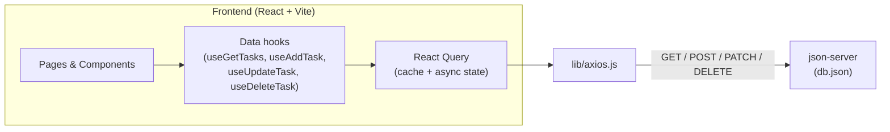

# Task Manager

<p align="center">
  
  
  
  
  
</p>

<p align="center">
  A task manager with an intuitive layout and clean design, organized by time of day (morning, afternoon and evening), with a dashboard of indicators and persistence through a simulated REST API.
</p>

<p align="center">
  <a href="https://fsc-task-manager-sepia.vercel.app/"><strong>Live Demo (Vercel)</strong></a>
</p>

---

## Table of Contents

- [About the project](#about-the-project)
- [Features](#features)
- [Technologies](#technologies)
- [Application architecture](#application-architecture)
- [Folder structure](#folder-structure)
- [Routes](#routes)
- [How to run the project](#how-to-run-the-project)
- [Available scripts](#available-scripts)
- [Data model](#data-model)
- [Author](#author)

---

## About the project

**Task Manager** is a **Single Page Application (SPA)** built with a strong focus on **componentization**, prioritizing modularity and maintainability. Navigation between pages is handled with **React Router**, while **React Query** manages the entire data-fetching, caching, and synchronization cycle, avoiding scattered manual loading/error states throughout the code.

The backend is simulated with **json-server**, which enables full **CRUD** operations (create, read, update, and delete tasks) without needing a "real" server — ideal for rapid prototyping.

## Features

| Feature | Description |
| --- | --- |
| **Dashboard** | Cards showing total tasks, not-started tasks, in-progress tasks, and completed tasks |
| **Organization by time of day** | Tasks are visually separated into **Morning**, **Afternoon**, and **Evening** |
| **Create task** | Registration modal with form validation (`react-hook-form`) |
| **Update status** | Interactive checkbox that cycles through `not started -> in progress -> done` |
| **Task details** | Dedicated page (`/task/:taskId`) to view and edit a specific task |
| **Delete task** | Removal with visual feedback (loading state on the button) |
| **Notifications (Toasts)** | Success/error feedback for each action via `sonner` |
| **Smooth transitions** | Enter/exit animations with `react-transition-group` |

## Technologies

- **[React](https://react.dev/)** `18.2` — UI library chosen for its modularity and composition flexibility
- **[Vite](https://vitejs.dev/)** — build tool and dev server, with fast HMR
- **[Tailwind CSS](https://tailwindcss.com/)** — utility-first styling, chosen for practicality and speed
- **[tailwind-variants](https://www.tailwind-variants.org/)** — typed style variants for components
- **[React Router DOM](https://reactrouter.com/)** — routing between pages (SPA)
- **[TanStack React Query](https://tanstack.com/query)** — caching, revalidation, and API synchronization
- **[Axios](https://axios-http.com/)** — HTTP client for communicating with the API
- **[json-server](https://github.com/typicode/json-server)** — fake REST API generated from a `db.json` file
- **[React Hook Form](https://react-hook-form.com/)** — form validation and control
- **[Sonner](https://sonner.emilkowal.ski/)** — toasts/notifications
- **[UUID](https://www.npmjs.com/package/uuid)** — unique identifier generation
- **ESLint + Prettier** — code quality and formatting standards

## Application architecture



The UI never talks to the API directly: all communication goes through **custom hooks** (`src/hooks/data`), which wrap React Query's `useQuery`/`useMutation`. This keeps components clean and centralizes caching logic in a single place.

## Folder structure

```
fsc-task-manager/
├── public/                     # Static files (favicon, etc.)
├── src/
│   ├── components/             # Reusable UI components
│   │   ├── Header.jsx
│   │   ├── Sidebar.jsx
│   │   ├── DashBoardCards.jsx
│   │   ├── DashboardCard.jsx
│   │   ├── Tasks.jsx
│   │   ├── TaskItem.jsx
│   │   ├── TasksSeparator.jsx
│   │   ├── AddTaskDialog.jsx
│   │   ├── Button.jsx / Input.jsx / TimeSelect.jsx
│   │   └── assets/              # Icons (SVG) and fonts
│   ├── hooks/
│   │   └── data/                # Data-access hooks (React Query)
│   │       ├── use-get-tasks.js
│   │       ├── use-get-task.js
│   │       ├── use-add-task.js
│   │       ├── use-update-task.js
│   │       └── use-delete-task.js
│   ├── keys/                    # React Query cache keys
│   │   ├── queries.js
│   │   └── mutations.js
│   ├── lib/
│   │   └── axios.js              # Configured Axios instance
│   ├── pages/
│   │   ├── home.jsx              # Dashboard (route "/")
│   │   ├── TasksPage.jsx         # Task list (route "/tasks")
│   │   └── TaskDetails.jsx       # Details/edit (route "/task/:taskId")
│   ├── db.json                   # Simulated database (json-server)
│   ├── index.css                 # Global styles + Tailwind directives
│   └── main.jsx                  # Entry point + route configuration
├── vercel.json                   # Vercel deployment configuration
├── tailwind.config.js
├── vite.config.js
└── package.json
```

## Routes

| Route | Page | Description |
| --- | --- | --- |
| `/` | `HomePage` | Dashboard with indicators and a summary of tasks |
| `/tasks` | `TasksPage` | Full list, split into Morning / Afternoon / Evening |
| `/task/:taskId` | `TaskDetailsPage` | View and edit a specific task |

## How to run the project

> **Prerequisites:** [Node.js](https://nodejs.org/) installed.

```bash
# 1. Clone the repository
git clone https://github.com/joaovpzdev/fsc-task-manager.git

# 2. Go into the project folder
cd fsc-task-manager

# 3. Install dependencies
npm install

# 4. Start the simulated API (json-server)
npm run server

# 5. In another terminal, run the application
npm run dev
```

The application will be available at `http://localhost:5173` and the simulated API at `http://localhost:3000`.

## Available scripts

| Script | Command | What it does |
| --- | --- | --- |
| `dev` | `npm run dev` | Starts the development server (Vite) |
| `server` | `npm run server` | Starts the fake API with `json-server`, watching `db.json` |
| `build` | `npm run build` | Generates the production build |
| `preview` | `npm run preview` | Serves the production build locally |
| `lint` | `npm run lint` | Runs ESLint on the project |

## Data model

Each task follows this format in `db.json`:

```json
{
  "id": "auto-generated-uuid",
  "title": "Train",
  "time": "morning",       // "morning" | "afternoon" | "evening"
  "description": "Run",
  "status": "not_started"  // "not_started" | "in_progress" | "done"
}
```

## Author

Developed by **João Victor Paixão Zolim** ([@joaovpzdev](https://github.com/joaovpzdev)).

<p align="center">Built with React + Tailwind</p>
